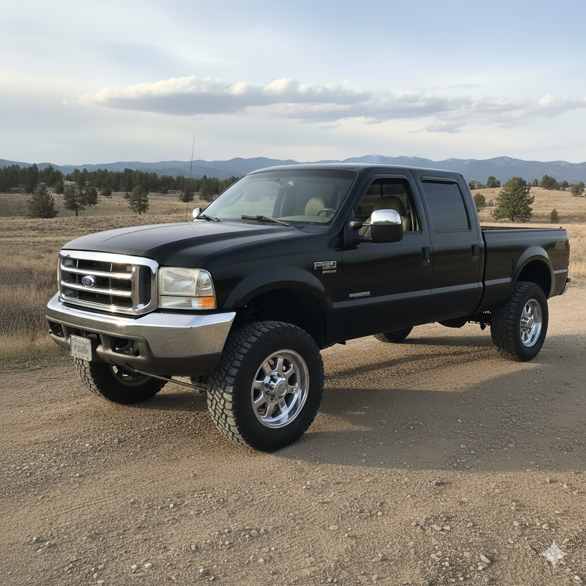

# Project: 1999 Ford F250 Super Duty 7.3L Diesel 4x4

**Purpose:** Maintain, upgrade, and keep running a reliable daily driver truck.

**History:** Owned since 2011; purchased for $10k shipped from Colorado. Burned biofuel initially, now standard diesel. Paid off, main daily driver, annual maintenance required for PA inspection. Many upgrades over the years: injectors, exhaust, battery/wires, locker, leveling kit, body work.

**Current Focus:** 2026 PA inspection and completing ongoing maintenance/upgrades. Balance cost, reliability, and utility.

**Constraints:** Must remain affordable, practical, and reliable; not a show vehicle; can handle dirt roads/woods; family-friendly; no large monthly payments.

